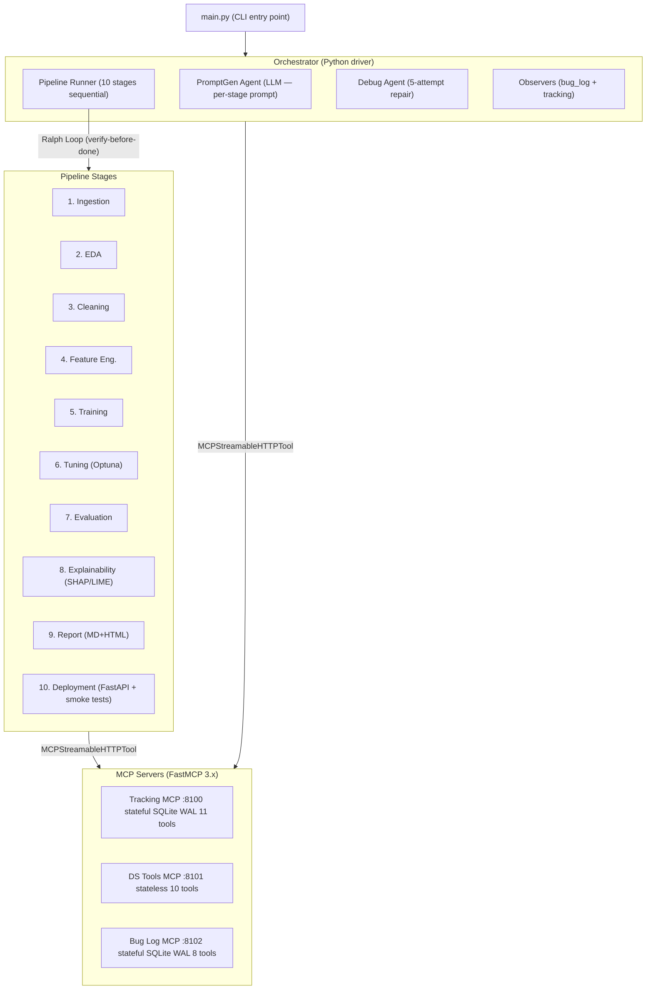

# MAF DS Agent — Autonomous Data Science Pipeline

> **Stack:** Microsoft Agent Framework 1.0 (Python) · Azure OpenAI (GPT-4o) · MCP Streamable HTTP · FastMCP 3.x · DuckDuckGo
>
> **Philosophy (Harness Engineering):** Trap the system in a loop that never declares done until tests pass and outputs are verified. Never trust "I finished" — trust passing criteria only.

---

## Table of Contents

- [Overview](#overview)
- [Architecture](#architecture)
- [Harness Engineering Principles](#harness-engineering-principles)
- [Project Structure](#project-structure)
- [Quick Start](#quick-start)
- [Environment Setup](#environment-setup)
- [Starting MCP Servers](#starting-mcp-servers)
- [Running the Pipeline](#running-the-pipeline)
- [Agents Reference](#agents-reference)
- [MCP Servers Reference](#mcp-servers-reference)
- [Memory System](#memory-system)
- [Testing](#testing)
- [Docker Deployment](#docker-deployment)
- [CI/CD](#cicd)
- [Configuration](#configuration)

---

## Overview

MAF DS Agent is a fully autonomous data-science pipeline that ingests raw data files (CSV, Excel, PDF, images, pretrained models) and produces trained ML models with explanations, reports, and a deployed FastAPI inference endpoint — with **zero human intervention** by default.

The system is built on **Microsoft Agent Framework 1.0** and wired together by a **Python Orchestrator** that drives a multi-stage pipeline through 13 specialised agents coordinating via three **FastMCP** model-context-protocol servers.

```
Input file → Orchestrator → [10 pipeline stages] → Trained model + Report + API endpoint
                ↕                    ↕                          ↕
        Tracking MCP           Ralph Loop              Debug Agent
        Bug Log MCP           (verify-before-done)    (5-attempt repair)
        DS Tools MCP
```

---

## Architecture



### Ralph Loop (Self-Correcting Verification)

Every pipeline stage runs inside a **Ralph Loop** — a verify-before-done control loop:

```
while not done and iterations < max:
    response = agent.run(prompt)
    if "<DONE>stage_name</DONE>" in response.text:
        verify criteria
        if criteria_pass: done = True
        else: prompt = "Criteria FAILED: {details}. Fix and retry."
    else:
        prompt = "Output not yet complete. Continue."
if not done: → Debug Agent (5-attempt repair protocol)
```

---

## Harness Engineering Principles

| Principle | Implementation |
|-----------|---------------|
| **Pipeline Gates** | Ralph Loop — every stage verifies explicit `StageCriteria` before declaring done |
| **Canary Smoke Tests** | Deployment Agent runs 10/10 live HTTP smoke tests on the deployed endpoint |
| **Feature Flags** | `PIPELINE_HUMAN_IN_THE_LOOP=true` pauses at each stage gate for human confirmation |
| **Self-Healing** | Debug Agent performs up to 5 structured repair attempts using MCP tools |
| **Observability** | OpenTelemetry via `TelemetryMiddleware`; all stage events recorded to Tracking MCP |
| **Continuous Verification** | Observer agents (Bug Log + Artefact Tracking) run after every stage |

---

## Project Structure

```
maf_ds_agent/
├── main.py                              # CLI entry point
├── pyproject.toml                       # Pinned dependencies (60+ packages)
├── .env.example                         # Required environment variables
├── docker-compose.yml                   # Three MCP server containers
├── Dockerfile.tracking                  # Tracking MCP container
├── Dockerfile.ds_tools                  # DS Tools MCP container
├── Dockerfile.bug_log                   # Bug Log MCP container
│
├── config/
│   ├── settings.py                      # Pydantic BaseSettings (env-driven)
│   └── library_registry.py             # Library → documentation URL registry
│
├── mcp_servers/
│   ├── tracking/server.py               # Port 8100 — 11 tools, SQLite WAL
│   ├── ds_tools/server.py               # Port 8101 — 10 tools (stateless)
│   └── bug_log/server.py                # Port 8102 — 8 tools, SQLite WAL
│
├── agents/
│   ├── clients.py                       # Lazy Azure OpenAI client proxies
│   ├── middleware.py                    # 5 middleware + 3 factory stacks
│   ├── base.py                          # MCP client factories + agent builders
│   ├── orchestrator.py                  # PipelineOrchestrator Python driver
│   ├── ingestion_agent.py               # Stage 1: data loading + validation
│   ├── eda_agent.py                     # Stage 2: exploratory data analysis
│   ├── cleaning_agent.py                # Stage 3: missing values, outliers
│   ├── feature_agent.py                 # Stage 4: feature engineering
│   ├── training_agent.py                # Stage 5: model training
│   ├── tuning_agent.py                  # Stage 6: Optuna hyperparameter tuning
│   ├── evaluation_agent.py              # Stage 7: metrics + bias checks
│   ├── explainability_agent.py          # Stage 8: SHAP, LIME, GradCAM
│   ├── report_agent.py                  # Stage 9: Markdown + HTML report
│   ├── deployment_agent.py              # Stage 10: FastAPI + 10/10 smoke tests
│   ├── debug_agent.py                   # Support: 5-attempt repair protocol
│   ├── bug_log_observer.py              # Support: bug pattern observer
│   └── artefact_tracking_observer.py   # Support: artefact lineage observer
│
├── workflows/
│   ├── ralph_loop.py                    # Verify-before-done control loop
│   ├── criteria.py                      # Per-stage StageCriteria classes
│   └── pipeline_graph.py                # 4 pipeline variants
│
├── tools/
│   ├── file_type_detector.py            # 3-layer: Magika → filetype → extension
│   ├── local_tools.py                   # 4 @tool functions
│   └── readers/
│       ├── dispatcher.py
│       ├── tabular.py                   # CSV/Excel/Parquet/JSON
│       ├── document.py                  # PDF/DOCX/TXT/HTML
│       ├── image.py                     # PNG/JPG/BMP/GIF
│       └── model.py                     # ONNX/SafeTensors/joblib/pickle
│
├── memory/
│   ├── __init__.py
│   └── agent_memory.py                  # SQLite-backed persistent agent memory
│
├── scripts/
│   └── start_servers.py                 # Launch + health-gate all 3 MCP servers
│
├── tests/
│   ├── test_imports.py                  # 19 import/structure tests (no network)
│   └── test_integration.py             # MCP server integration tests
│
└── .github/workflows/ci.yml            # GitHub Actions: lint + unit + integration
```

---

## Quick Start

### Prerequisites

- Python 3.12+
- Azure OpenAI deployment (GPT-4o and GPT-4o-mini or equivalent)

### 1. Clone and install

```bash
git clone https://github.com/your-org/maf-ds-agent.git
cd maf-ds-agent
pip install -e .
```

### 2. Configure environment

```bash
cp .env.example .env
# Edit .env with your Azure OpenAI credentials
```

### 3. Start MCP servers

```bash
python scripts/start_servers.py
```

### 4. Run a pipeline

```bash
python main.py \
  --file /path/to/your/dataset.csv \
  --task "Train a classifier to predict customer churn" \
  --output ./pipeline_output
```

---

## Environment Setup

Copy `.env.example` to `.env` and fill in all values:

```bash
# Azure OpenAI (required)
AI_FOUNDRY_PROJECT_ENDPOINT=https://YOUR_RESOURCE.openai.azure.com
AI_FOUNDRY_API_KEY=your-api-key-here
AI_FOUNDRY_API_VERSION=2024-12-01-preview
AZURE_OPENAI_PRIMARY_DEPLOYMENT=gpt-4o
AZURE_OPENAI_FAST_DEPLOYMENT=gpt-4o-mini

# MCP server ports (optional — defaults shown)
TRACKING_MCP_PORT=8100
DS_TOOLS_MCP_PORT=8101
BUG_LOG_MCP_PORT=8102

# Data paths
TRACKING_DB_PATH=data/tracking.db
BUG_LOG_DB_PATH=data/bug_log.db
ARTEFACT_BASE_DIR=data/artefacts
MEMORY_DB_PATH=memory/agent_memory.db

# Pipeline behaviour
PIPELINE_HUMAN_IN_THE_LOOP=false
MAX_RALPH_ITERATIONS=8
```

---

## Starting MCP Servers

### All three servers (recommended)

```bash
python scripts/start_servers.py
```

The script launches all three servers as subprocesses, performs exponential-back-off
health checks (30 s timeout), exits non-zero if any server fails to become healthy
(**Harness pipeline gate**), and forwards Ctrl+C to all children for clean shutdown.

### Individual servers

```bash
python scripts/start_servers.py tracking           # port 8100 only
python scripts/start_servers.py ds_tools bug_log   # two servers
python scripts/start_servers.py --check            # health-check only
```

### MCP URLs

| Server | URL | Stateful |
|--------|-----|----------|
| Tracking MCP | `http://localhost:8100/mcp/mcp` | Yes (SQLite WAL) |
| DS Tools MCP | `http://localhost:8101/mcp/mcp` | No (stateless) |
| Bug Log MCP  | `http://localhost:8102/mcp/mcp` | Yes (SQLite WAL) |

Each server also exposes `/health` for liveness checks.

---

## Running the Pipeline

```bash
# Basic usage
python main.py --file data/titanic.csv --task "Predict survival"

# With custom run ID
python main.py \
  --file data/sales_data.xlsx \
  --task "Forecast monthly revenue" \
  --run-id my-experiment-001

# Enable human-in-the-loop gates
PIPELINE_HUMAN_IN_THE_LOOP=true python main.py --file data.csv --task "..."
```

### Pipeline Variants (auto-selected by file type)

| File Type | Variant | Stages |
|-----------|---------|--------|
| CSV / Excel / Parquet / JSON | `tabular` | 10 stages (all) |
| PDF / DOCX / TXT / HTML | `document_text` | 10 stages |
| PNG / JPG / BMP | `image` | 8 stages (no EDA/cleaning) |
| ONNX / SafeTensors / joblib | `existing_model` | 5 stages (eval → deploy) |

---

## Agents Reference

### Pipeline Agents (10 stages)

| Agent | Client | Done Tag |
|-------|--------|----------|
| `ingestion_agent` | FAST | `<DONE>ingestion</DONE>` |
| `eda_agent` | FAST | `<DONE>eda</DONE>` |
| `cleaning_agent` | PRIMARY | `<DONE>cleaning</DONE>` |
| `feature_agent` | PRIMARY | `<DONE>feature_engineering</DONE>` |
| `training_agent` | PRIMARY | `<DONE>training</DONE>` |
| `tuning_agent` | FAST | `<DONE>tuning</DONE>` |
| `evaluation_agent` | PRIMARY | `<DONE>evaluation</DONE>` |
| `explainability_agent` | PRIMARY | `<DONE>explainability</DONE>` |
| `report_agent` | PRIMARY | `<DONE>report</DONE>` |
| `deployment_agent` | FAST | `<DONE>deployment</DONE>` |

### Support Agents

| Agent | Role |
|-------|------|
| `debug_agent` | 5-attempt structured repair using all MCP tools |
| `bug_log_observer` | Records error patterns to Bug Log MCP after each stage |
| `artefact_tracking_observer` | Verifies artefact lineage and metadata |

### Middleware Stacks

```python
pipeline_stack()  # Logging + RateLimit + Safety + Retry + Telemetry
observer_stack()  # Logging + Telemetry (no rate limiting)
debug_stack()     # Logging + Retry + Telemetry (no SafetyMiddleware)
```

---

## MCP Servers Reference

### Tracking MCP (port 8100) — 11 tools

`record_start`, `record_end`, `record_checkpoint`, `record_artefact`, `record_metric`,
`record_lineage`, `query_run`, `query_artefacts`, `query_metrics`, `query_lineage`, `list_runs`

### DS Tools MCP (port 8101) — 10 tools

`read_file`, `execute_code`, `get_sample`, `write_output`, `search_docs`,
`web_research`, `embed_text`, `semantic_search`, `log_metrics`, `verify_stage`

### Bug Log MCP (port 8102) — 8 tools

`record_bug`, `update_bug`, `list_bugs`, `get_bug`, `search_bugs`,
`get_stats`, `export_report`, `clear_run`

---

## Memory System

SQLite-backed persistent memory store scoped to `(agent_name, run_id)` pairs.

```python
from memory.agent_memory import AgentMemory

mem = AgentMemory(agent_name="training_agent", run_id="run-abc123")
mem.remember("best_model", "XGBoostClassifier")
mem.remember("best_params", {"n_estimators": 200, "max_depth": 6})

model = mem.recall("best_model")        # "XGBoostClassifier"
params = mem.recall("best_params")      # {"n_estimators": 200, ...}

mem.remember_global("dataset_shape", [10000, 45])
shape = mem.recall_global("dataset_shape")

results = mem.search("XGBoost")
context_str = mem.as_context_string()   # prompt-ready string
```

**Self-Healing:** The Debug Agent stores successful repair strategies so subsequent
failures can recall what worked previously without re-discovering from scratch.

---

## Testing

### Unit tests (no network required)

```bash
python -m pytest tests/test_imports.py -v
# Expected: 19/19 passing
```

### Integration tests (MCP servers must be running)

```bash
python scripts/start_servers.py &
sleep 5
python -m pytest tests/test_integration.py -v
```

Integration tests auto-skip when servers are not reachable:

```bash
python -m pytest tests/ -v  # unit tests run; integration skip if offline
```

### Coverage

```bash
python -m pytest tests/test_imports.py \
  --cov=agents --cov=workflows --cov=tools --cov=config \
  --cov-report=term-missing
```

---

## Docker Deployment

```bash
# Build and start all MCP servers
docker compose up --build -d

# Check status
docker compose ps
docker compose logs -f

# Stop
docker compose down
```

Override ports via environment:

```bash
TRACKING_MCP_PORT=9100 docker compose up -d
```

---

## CI/CD

GitHub Actions (`ci.yml`) runs on push to `main`/`dev`/`feature/**` and PRs to `main`.

| Job | Description |
|-----|-------------|
| `lint` | Ruff linter + format check |
| `unit-tests` | 19 import tests, no network, fake Azure creds |
| `integration-tests` | Starts MCP servers, runs HTTP tests (needs unit-tests to pass) |

---

## Configuration

| Variable | Default | Description |
|----------|---------|-------------|
| `AI_FOUNDRY_PROJECT_ENDPOINT` | — | Azure OpenAI endpoint |
| `AI_FOUNDRY_API_KEY` | — | Azure OpenAI API key |
| `AZURE_OPENAI_PRIMARY_DEPLOYMENT` | `gpt-4o` | Heavy reasoning stages |
| `AZURE_OPENAI_FAST_DEPLOYMENT` | `gpt-4o-mini` | Fast/cheap stages |
| `TRACKING_MCP_PORT` | `8100` | Tracking MCP port |
| `DS_TOOLS_MCP_PORT` | `8101` | DS Tools MCP port |
| `BUG_LOG_MCP_PORT` | `8102` | Bug Log MCP port |
| `MEMORY_DB_PATH` | `memory/agent_memory.db` | Agent memory SQLite |
| `PIPELINE_HUMAN_IN_THE_LOOP` | `false` | Pause at each stage gate |
| `MAX_RALPH_ITERATIONS` | `8` | Max Ralph Loop iterations per stage |

---

## License

MIT
